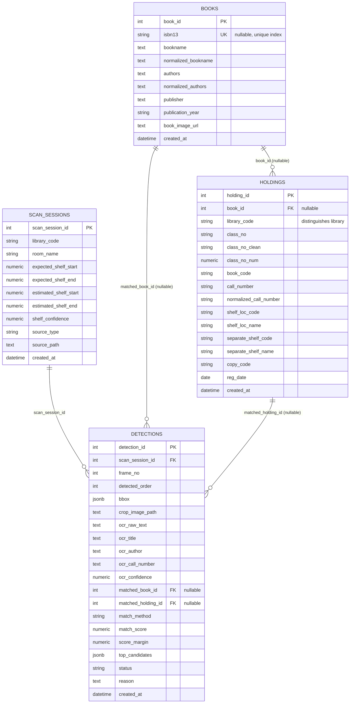

# Catalog ERD

Entity-relationship diagram for `books` / `holdings` / `scan_sessions` / `detections`
(source: `worker/db_models/catalog.py`, `worker/db_models/inference.py`,
current schema as of `alembic/versions/2b9f0f3e7a12_preserve_detection_review_metadata.py`).

`holdings.library_code` is what distinguishes libraries — adding a new library
(e.g. Dobong-Ainara, `libCode=111189`) requires no schema change, only new rows.

## Notes

- `books.isbn13` is unique but nullable — multiple books with no ISBN are
  allowed (Postgres treats each `NULL` as distinct under a unique index).
  See `worker/services/catalog_etl.py` (`process_and_load_items`) and
  `scripts/load_library_excel.py`, both of which normalize a missing ISBN to
  `None` rather than `""` for this reason.
- `holdings.book_id` is nullable: a holding row is created even when no
  matching `books` row was found (e.g. ISBN-less items matched by
  bookname/authors/publisher instead — see `load_library_excel.py`).
- `detections.matched_book_id` / `matched_holding_id` are both nullable
  because a detection may end up `unmatched` (see `detections.status`).
